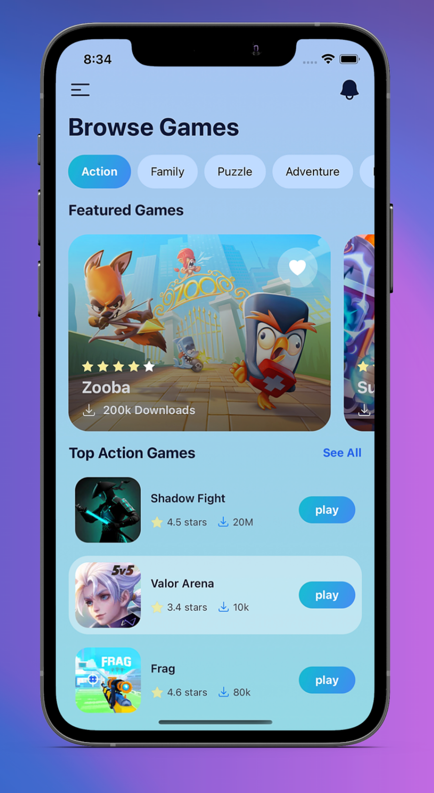

# APP-STORE REACT-NATIVE (TAILWIND CSS)

<!--## Overview-->

<!---->

  

## Get Started

install dev dependencies

### `npm install` or `yarn install`

## Then

Run The app

### `npm start` or `yarn start`

Runs your app in development mode.

Open it in the [Expo app](https://expo.io) on your phone to view it. It will reload if you save edits to your files, and you will see build errors and logs in the terminal.

#### `npm run ios` or `yarn run ios`

Like `npm start` / `yarn start`, but also attempts to open your app in the iOS Simulator if you're on a Mac and have it installed.

#### `npm run android` or `yarn run android`

Like `npm start` / `yarn start`, but also attempts to open your app on a connected Android device or emulator. Requires an installation of Android build tools (see [React Native docs](https://facebook.github.io/react-native/docs/getting-started.html) for detailed setup).

 

  

  

  

