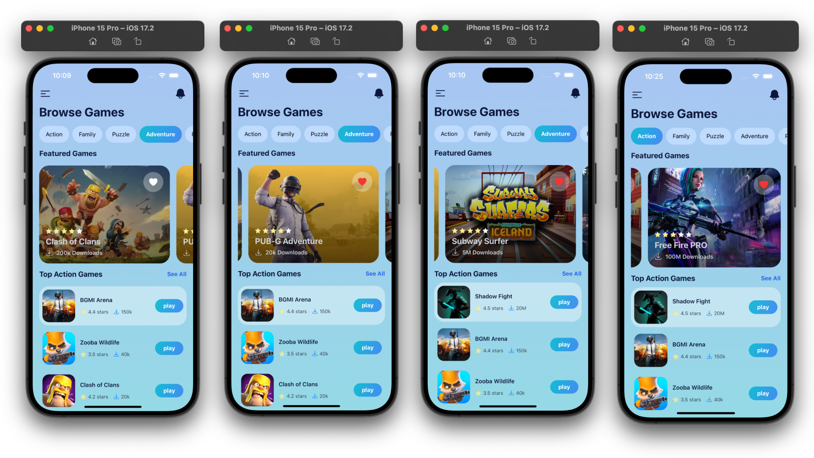

# APP-STORE REACT-NATIVE (TAILWIND CSS)

## Overview

  

## Get Started

install dev dependencies

### `npm install` or `yarn install`

## Then

Run The app

### `npm start` or `yarn start`

 

  

  

  

